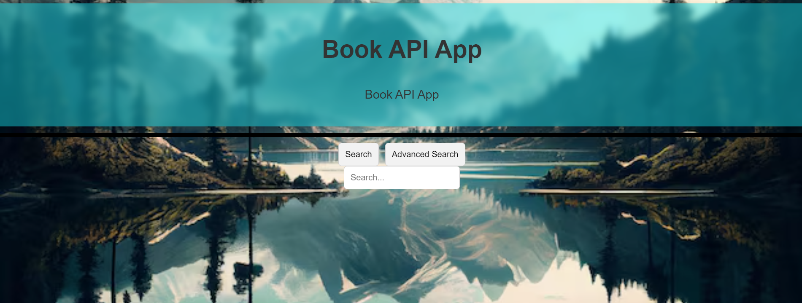

# api-book-app

**the app has 4 active screens:**

- Home screen:
  

  
  The home page welcome the user to the app and give him link to the "search" screen.

- List Books screen:
  
  The list Books screen have a list of books will be shown. The intial books are from the search term "dev"
- Search screen:
  

  
  In this screen the user can search the book he want, based on name only (in the simple search) or with other parameters (in the advanced search).

- About screen:
  
  In the about screen include a link to my GitHub user and a simple intrudaction to the app.
